# Windows/Linux Enterprise Network

A hybrid Windows and Linux enterprise network built to demonstrate hands-on administration, networking, and Help Desk support skills. The environment integrates Windows Server 2022, Windows 11 workstations, and Ubuntu Server systems across two routed subnets.

The project includes Active Directory Domain Services, DNS, DHCP and DHCP relay, Linux routing and firewalling, Active Directory-integrated Samba file sharing, and common user account support scenarios such as password resets, account lockouts, disabled accounts, and security group changes.

## Network Topology

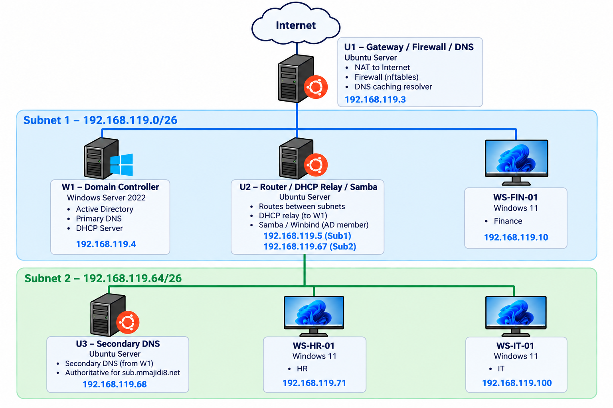

The environment is divided into two `/26` internal subnets connected through a Linux router. Windows Server provides centralized Active Directory, DNS, and DHCP services, while the Ubuntu servers provide routing, firewalling, DNS, DHCP relay, and domain-integrated file services.

| System | Operating System | IP Address | Primary Role |
|---|---|---|---|
| W1 | Windows Server 2022 | `192.168.119.4` (Static) | Domain Controller, DNS, DHCP |
| U1 | Ubuntu Server | `192.168.119.3` (Static) | Gateway, Firewall, Caching DNS Resolver |
| U2 | Ubuntu Server | `192.168.119.5` / `192.168.119.67` (Static) | Router, DHCP Relay, Samba File Server |
| U3 | Ubuntu Server | `192.168.119.68` (Static) | DNS Server |
| WS-FIN-01 | Windows 11 | `192.168.119.10` (DHCP) | Finance Workstation |
| WS-HR-01 | Windows 11 | `192.168.119.71` (DHCP) | HR Workstation |
| WS-IT-01 | Windows 11 | `192.168.119.100` (DHCP Reservation) | IT Workstation |

## Active Directory

Windows Server 2022 (W1) serves as the domain controller for the `mmajidi8.net` Active Directory forest and domain. Active Directory provides centralized authentication and management for the Windows workstations and user accounts in the environment.

The directory was organized using separate Organizational Units (OUs) for employees, groups, and workstations. Three departmental security groups, Finance, HR, and IT, were created to manage access to resources based on group membership.

Test user accounts were created for each department:

| User | Department | Workstation |
|---|---|---|
| Sarah Dawson | Finance | WS-FIN-01 |
| Daniel Chen | HR | WS-HR-01 |
| John Smith | IT | WS-IT-01 |

All three Windows 11 workstations were joined to the `mmajidi8.net` domain and authenticated using domain user accounts.

### Active Directory Users and Groups

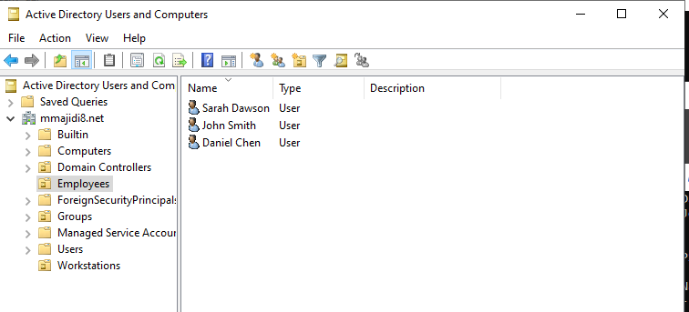

### Domain-Joined Workstations

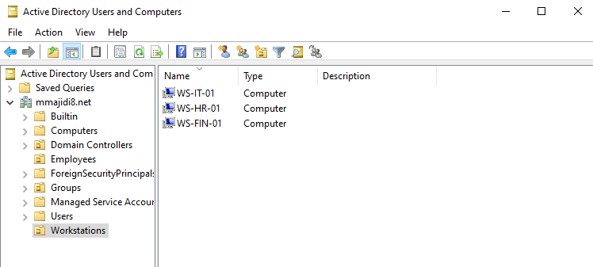

## DHCP and DHCP Relay

W1 provides centralized DHCP services for both internal subnets. Separate DHCP scopes were configured so that clients receive addressing appropriate to their local network, including the correct default gateway, DNS servers, and DNS domain.

| Scope | Address Pool | Default Gateway | DNS Servers |
|---|---|---|---|
| Subnet 1 (`192.168.119.0/26`) | `192.168.119.10–60` | `192.168.119.3` (U1) | `192.168.119.4`, `192.168.119.68` |
| Subnet 2 (`192.168.119.64/26`) | `192.168.119.70–120` | `192.168.119.67` (U2) | `192.168.119.4`, `192.168.119.68` |

Clients on Subnet 1 can communicate directly with the DHCP server on W1. Because DHCP broadcasts do not normally cross routers, U2 runs an ISC DHCP relay to forward DHCP traffic between Subnet 2 and W1.

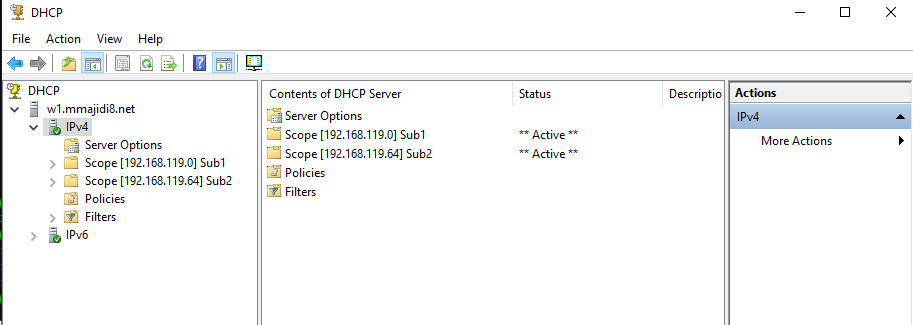

### DHCP Relay

U2 listens for DHCP traffic on both of its network interfaces and forwards requests to W1 at `192.168.119.4`. This allows Windows clients on Subnet 2 to obtain leases from the centralized DHCP server even though the server is located on Subnet 1.

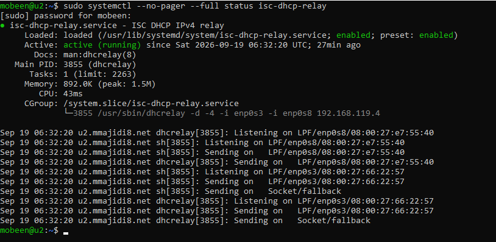

WS-HR-01 successfully received a dynamic address on Subnet 2 through the DHCP relay.

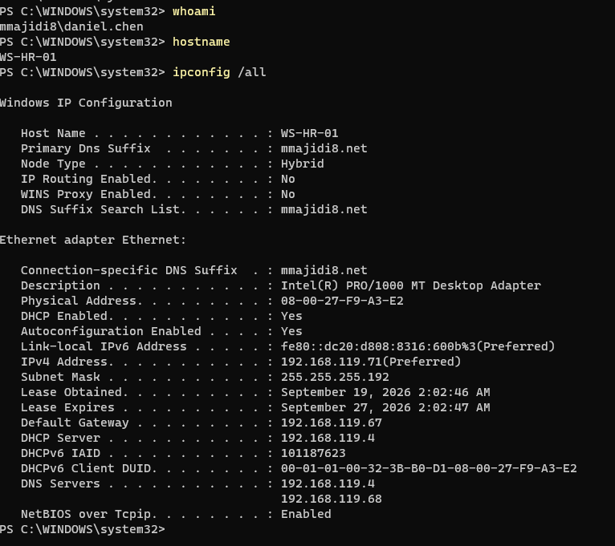

### DHCP Reservation

A DHCP reservation was configured for WS-IT-01, assigning `192.168.119.100` to the workstation based on its MAC address. This provides the workstation with a consistent IP address while retaining centralized DHCP management.

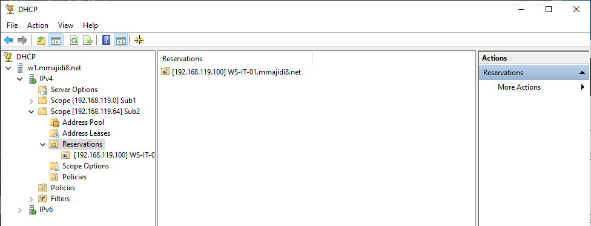

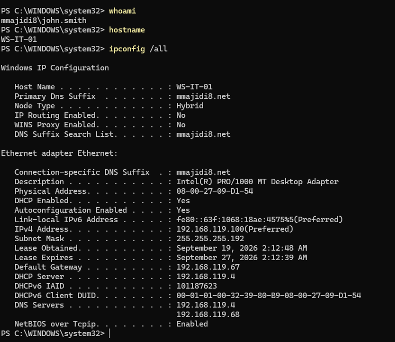

## DNS

DNS services are distributed across W1, U1, and U3 to support Active Directory, internal name resolution, reverse lookups, delegated DNS, and external name resolution.

| Server | DNS Role |
|---|---|
| W1 (`192.168.119.4`) | Primary AD-integrated DNS for `mmajidi8.net` and `\_msdcs.mmajidi8.net`; forwards external queries to U1 |
| U1 (`192.168.119.3`) | Caching recursive DNS resolver for external name resolution |
| U3 (`192.168.119.68`) | Primary DNS for `sub.mmajidi8.net` and the reverse zone; secondary DNS for the AD zones |

### Active Directory DNS

W1 hosts the primary AD-integrated DNS zones for `mmajidi8.net` and `\_msdcs.mmajidi8.net`. These zones provide internal name resolution and the DNS service records required by domain members to locate Active Directory services such as domain controllers and LDAP.

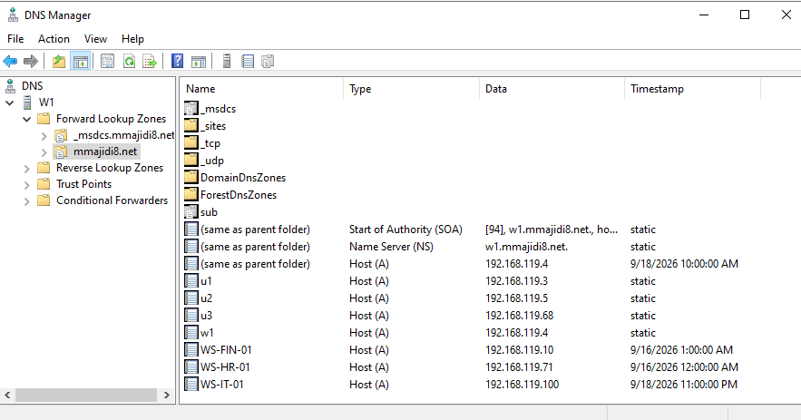

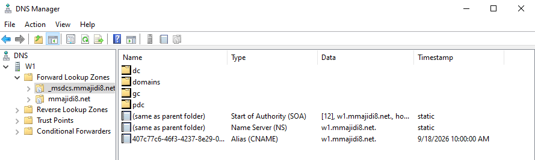

### Delegated Subdomain and Secondary DNS

The DNS subdomain `sub.mmajidi8.net` is delegated from W1 to U3. U3 is authoritative for this subdomain and hosts records for systems within it.

This allows U3 to serve records from the Windows-hosted Active Directory DNS zones as a secondary DNS server.

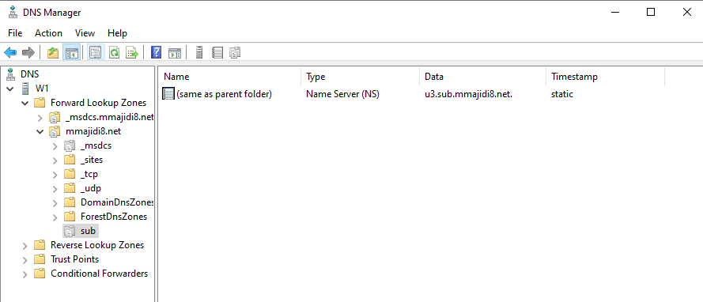

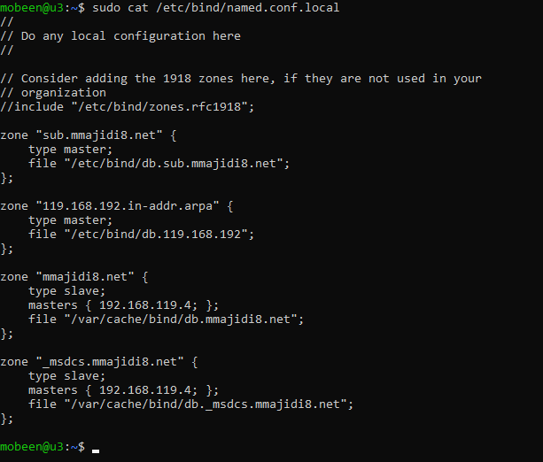

### Reverse DNS

U3 is authoritative for the `119.168.192.in-addr.arpa` reverse lookup zone and contains PTR records for the infrastructure servers.

W1 has an AD-integrated conditional forwarder for this reverse zone pointing to U3 at `192.168.119.68`. As a result, reverse lookup requests received by W1 for the internal network are forwarded to the DNS server authoritative for that zone.

### External DNS Resolution and Caching

U1 operates as a caching recursive resolver for external DNS queries. Rather than forwarding these requests to another configured DNS resolver, U1 performs recursive resolution and caches the resulting answers for subsequent queries.

W1 uses U1 at `192.168.119.3` as its DNS forwarder. When a domain client sends W1 a query that W1 cannot answer from its authoritative zones or a configured conditional forwarder, W1 forwards the request to U1 for external resolution.

U3 also forwards external DNS queries to U1. This provides a centralized path for external name resolution while W1 and U3 remain responsible for their respective internal DNS zones.

DNS caching on U1 was verified by querying the same external domain repeatedly. The first lookup required recursive resolution, while the subsequent lookup was returned from cache with a significantly lower query time.

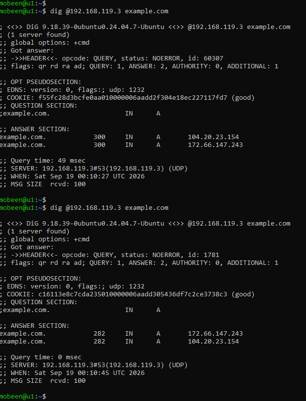

### DNS Verification

Forward and reverse DNS resolution were tested across the environment to confirm communication between the Windows and Linux DNS services and successful resolution of the required internal records.

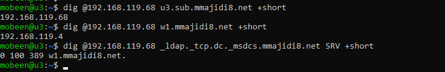

## Linux Routing and Firewalling

U1 and U2 provide the routing and firewall functions that connect the internal networks and control traffic between systems.

### U1 — Gateway and Internet Access

U1 acts as the gateway between the internal network and the external network. It has an internal interface at `192.168.119.3` and a separate NAT-facing interface used for external connectivity.

IPv4 forwarding is enabled on U1, and nftables provides stateful firewall filtering and source NAT (masquerading) for outbound traffic. U1 also maintains a route to Subnet 2 through U2 at `192.168.119.5`.

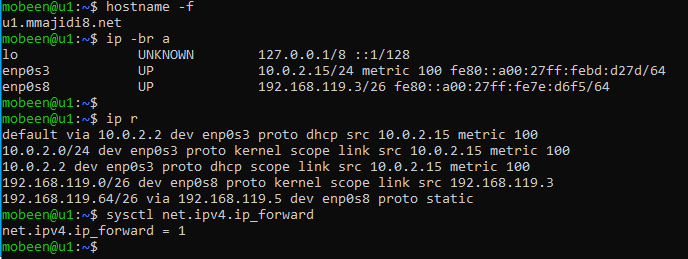

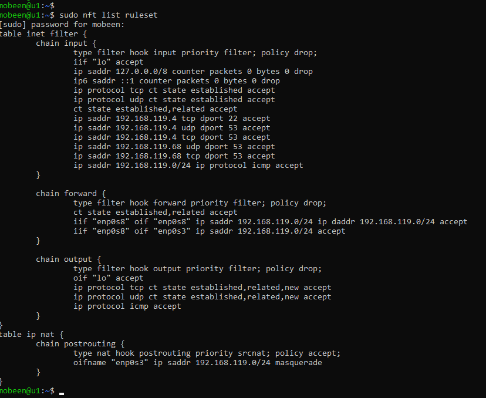

### U2 — Inter-Subnet Routing

U2 connects the two internal `/26` subnets using two network interfaces:

- `192.168.119.5/26` on Subnet 1

- `192.168.119.67/26` on Subnet 2

IPv4 forwarding allows U2 to route traffic between the two networks. Its default route points to U1 at `192.168.119.3`, providing Subnet 2 with a path toward external networks.

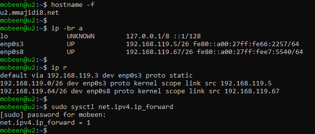

### Firewall Policy

Both Linux routers use nftables with default-drop policies and explicitly permitted traffic.

U2 permits established and related connections, required DHCP relay traffic, Samba access from the internal network, ICMP used for connectivity testing, and routed traffic between the two internal subnets. U1 controls traffic entering and leaving the internal network and performs masquerading for outbound Internet access.

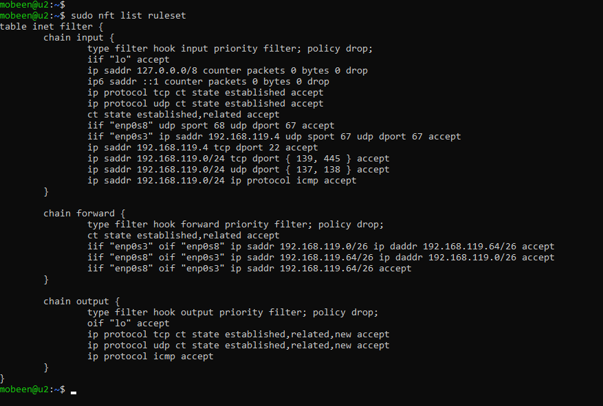

The complete firewall and network configurations are available in the [`configs`](configs/) directory.

## Samba File Services and Access Control

U2 also operates as an Active Directory-integrated Samba file server. The Ubuntu server was joined to the `mmajidi8.net` domain, allowing Samba and Winbind to use Active Directory identities and security groups rather than maintaining separate file-sharing accounts.

Three departmental shares were created:

| Share | Path | Authorized AD Group |
|---|---|---|
| Finance | `/srv/shares/finance` | Finance |
| HR | `/srv/shares/hr` | HR |
| IT | `/srv/shares/it` | IT |

Samba restricts each share using the corresponding Active Directory security group. Files are created with group read/write permissions, while directories use the setgid permission so that new content inherits the appropriate departmental group.

### Active Directory Integration

U2 was joined to the Windows domain as a member server. Samba and Winbind were configured to recognize users and groups from `MMAJIDI8.NET`, allowing access decisions to be based on centralized Active Directory identities.

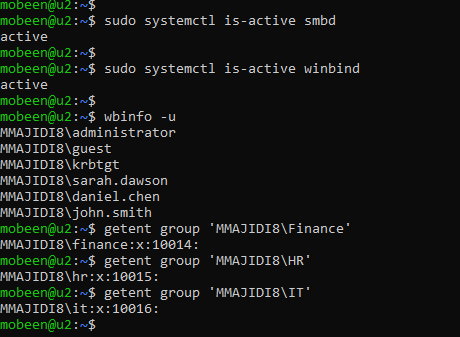

### Department-Based Access Control

Access was tested using domain accounts from different departments. John Smith, while a member of the IT security group, was able to access the IT share.

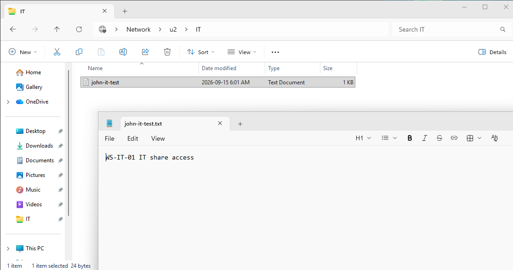

The same account was denied access to the HR share because it was not a member of the HR security group.

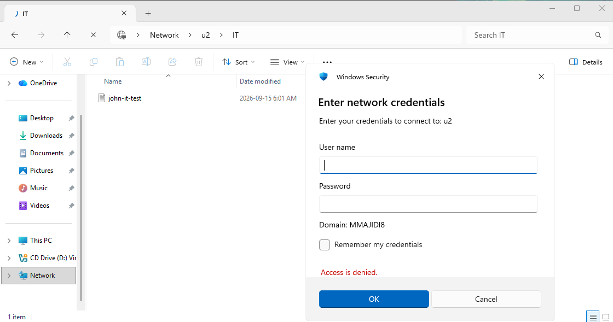

Access to the Linux-hosted file shares is therefore controlled through Active Directory group membership rather than separate Samba user accounts.

The Samba configuration is available at [`configs/u2/smb.conf`](configs/u2/smb.conf).

## Help Desk Administration Scenarios

Several common Help Desk and Active Directory support scenarios were performed using the domain user accounts and Windows 11 workstations. These tests included password resets, account lockouts, disabled accounts, and changes to security group membership.

### Password Reset and Required Password Change

John Smith's domain password was reset through Active Directory Users and Computers (ADUC). The account was configured to require the user to change the temporary password at the next logon.

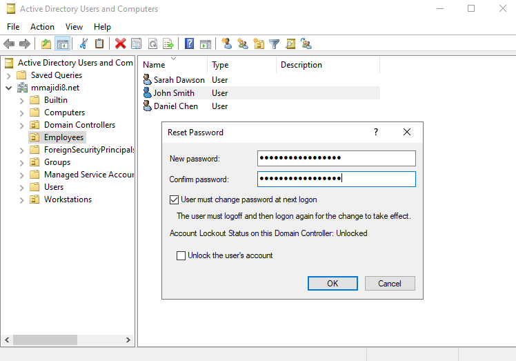

When John next authenticated to the domain, Windows required a password change before allowing the normal sign-in process to continue.

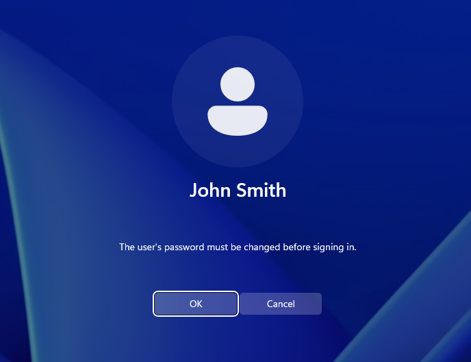

### Account Lockout

A domain account lockout policy was configured with a threshold of five failed logon attempts and a 30-minute lockout duration.

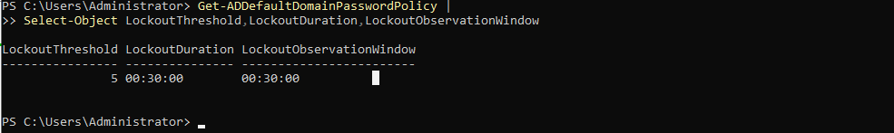

The policy was tested using Daniel Chen's account. Repeated incorrect authentication attempts caused the account to become locked. The locked account was then identified through Active Directory administration tools.

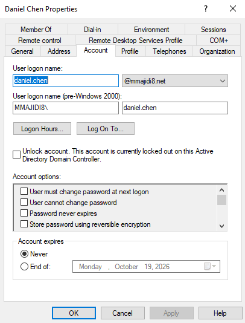

### Disabled Account

Sarah Dawson's account was deliberately disabled in Active Directory to test the effect on domain authentication. A subsequent sign-in attempt on the Finance workstation was rejected because the account was disabled.

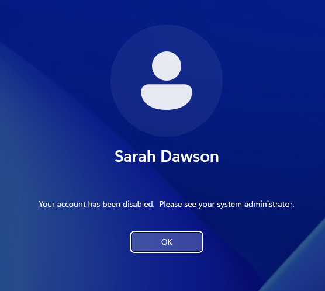

The account was then re-enabled in Active Directory and normal domain authentication was restored.

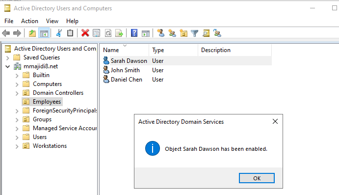

### Security Group and Resource Access Changes

John Smith was temporarily moved from the IT security group to the Finance security group to simulate a departmental access change.

After the group membership change and a new user logon session, John was able to access the Finance Samba share while access to the IT share was denied. This demonstrated how Active Directory security group membership can be used to centrally control access to resources hosted on a domain-integrated Linux file server.

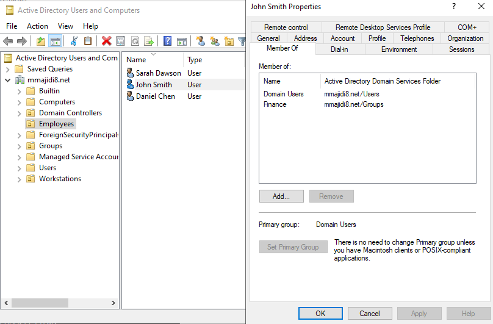

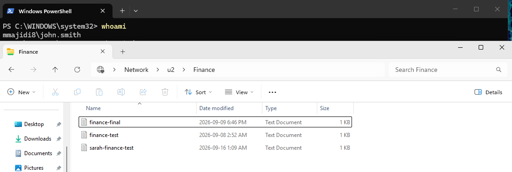

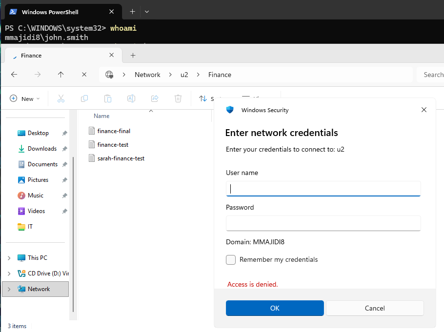

After testing, John was returned to the IT security group to restore his original departmental access.

## Troubleshooting

Several issues encountered while building and validating the environment required troubleshooting across Windows and Linux systems.

### Samba File Permission Issue

During file-sharing validation, a file in the Finance share was found with permissions of `744` rather than the intended `660` permissions.

The incorrect permissions allowed the file owner to read, write, and execute the file while other members of the assigned group only had read access. This did not match the intended departmental file-sharing model, where the owner and authorized group should both have read/write access.

The Samba share configuration was reviewed to verify the intended file creation settings of `create mask = 0660` and `force create mode = 0660`.

The affected file permissions were then corrected to `660`, aligning the file with the intended access model.

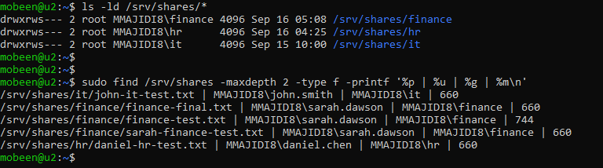

### Active Directory DNS Discovery

While integrating U2 with Active Directory, domain discovery depended on the DNS records stored within the `\_msdcs.mmajidi8.net` zone.

U3 was configured as a secondary DNS server for the main `mmajidi8.net` zone, but Active Directory also maintains a separate `\_msdcs.mmajidi8.net` zone containing service records used by domain members to locate domain controllers and services such as LDAP.

The DNS configuration was updated so that U3 also maintained a secondary copy of the `\_msdcs.mmajidi8.net` zone through a zone transfer from W1.

After the required Active Directory DNS records became available through U3, domain service discovery from the Linux environment was successfully verified.

The issue showed that network connectivity to the domain controller alone was not enough for domain integration. U2 also needed access to the required Active Directory DNS records to locate domain services correctly.

## Configuration Files

The Linux server configurations used in the environment are included in the [`configs`](configs/) directory.

| Server | Configuration |
|---|---|
| U1 | [Netplan](configs/u1/netplan.yaml) · [nftables](configs/u1/nftables.rules) · [BIND](configs/u1/named.conf.options) |
| U2 | [Netplan](configs/u2/netplan.yaml) · [nftables](configs/u2/nftables.rules) · [Samba](configs/u2/smb.conf) · [DHCP Relay](configs/u2/isc-dhcp-relay) |
| U3 | [Netplan](configs/u3/netplan.yaml) · [BIND Zones](configs/u3/named.conf.local) · [BIND Options](configs/u3/named.conf.options) · [Forward Zone](configs/u3/db.sub.mmajidi8.net) · [Reverse Zone](configs/u3/db.119.168.192) |

## Skills Demonstrated

- Active Directory user, group, OU, and workstation administration

- Domain joining and centralized user authentication

- Password resets, account lockouts, disabled accounts, and group membership changes

- Windows Server DNS and DHCP administration

- DHCP relay across routed networks

- DNS delegation, secondary zones, conditional forwarding, recursive resolution, and caching

- Linux network configuration and static routing

- nftables firewalling and NAT

- Active Directory-integrated Samba file sharing

- Group-based access control and Linux file permissions

- Windows and Linux network troubleshooting

